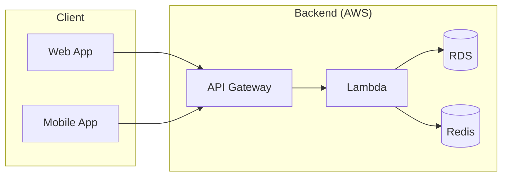
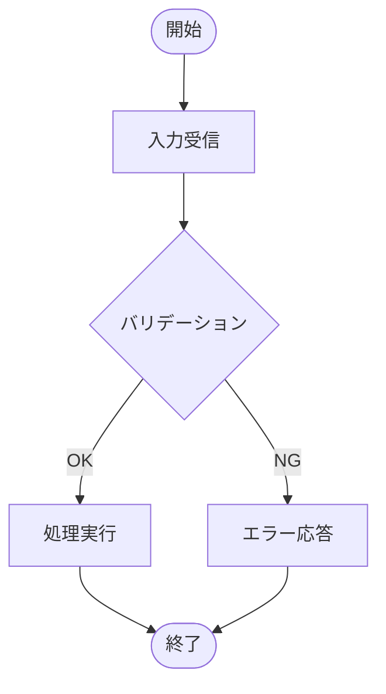
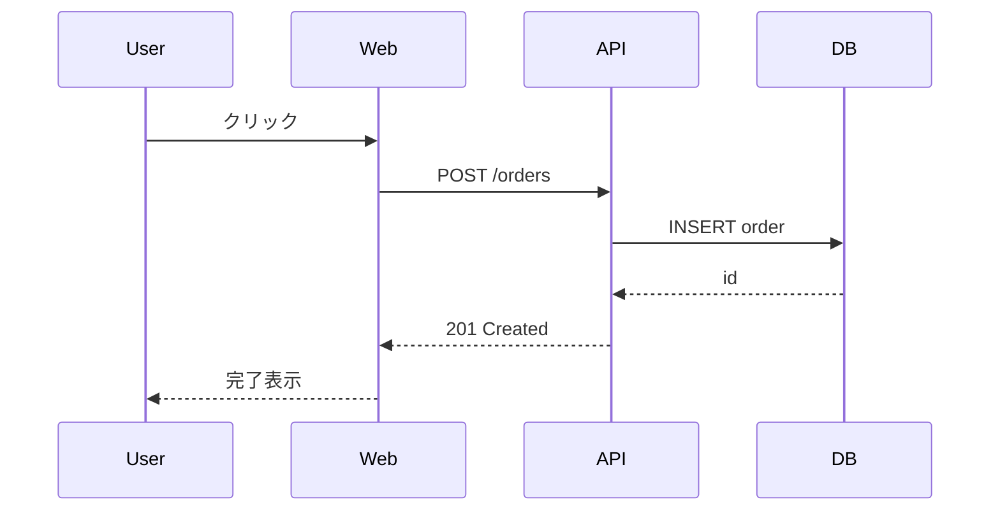
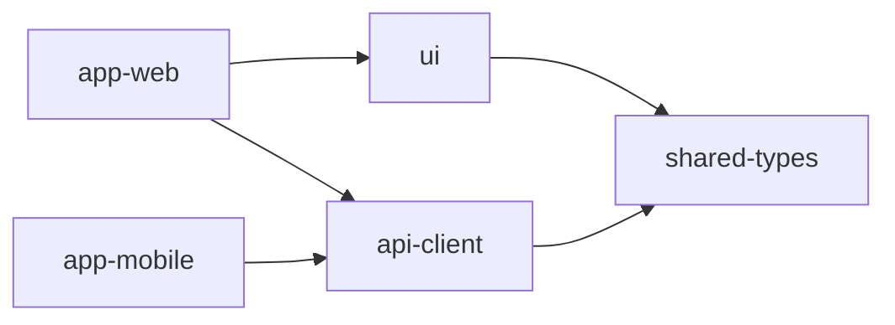
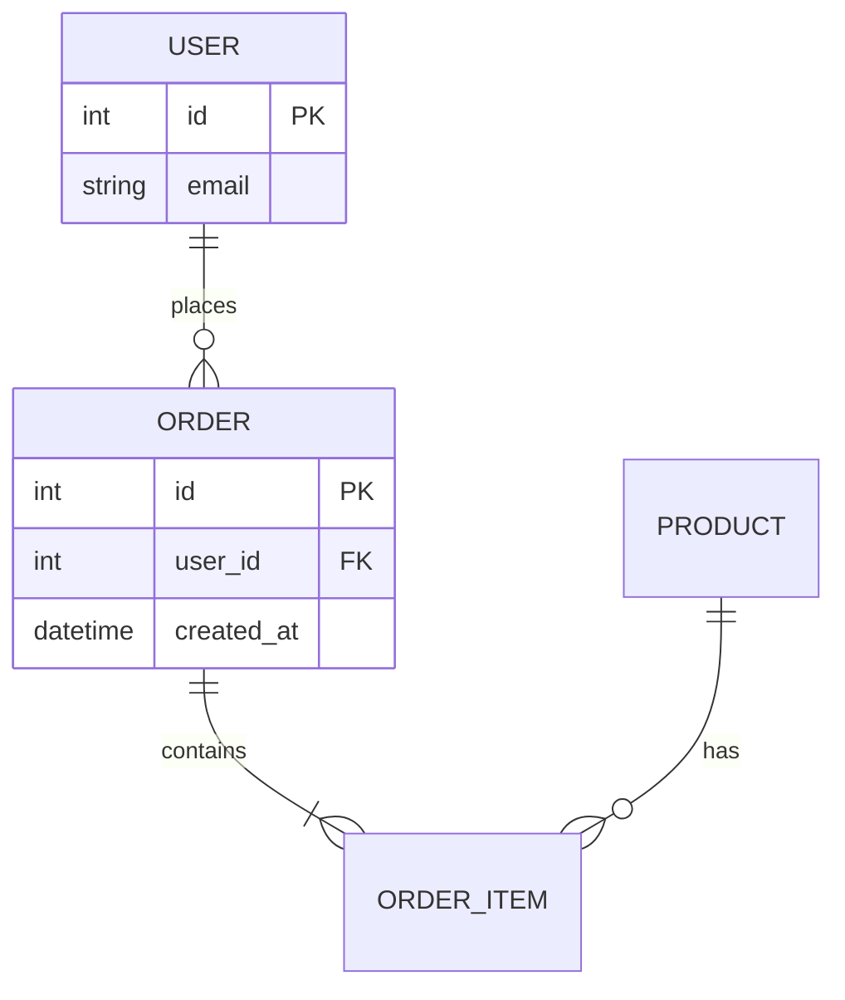
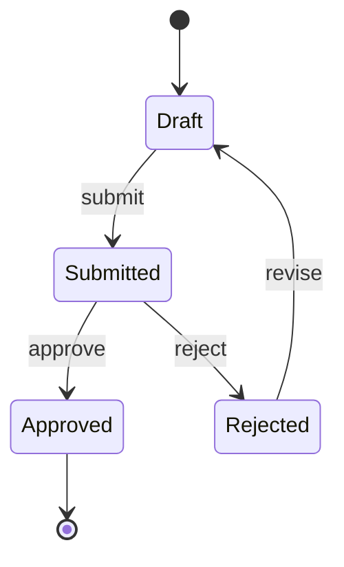
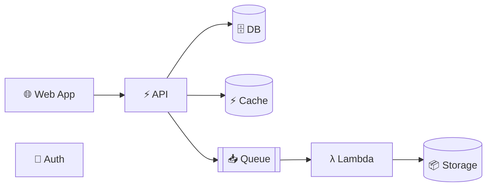
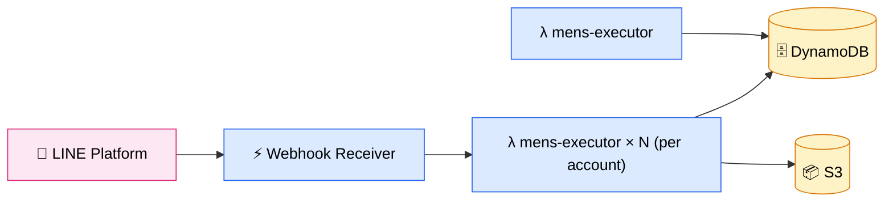

# diagram-render: draw-diagram

ユーザーから「図にして欲しい」「アーキテクチャ図」「フローチャート」「依存関係図」などの依頼を受けたら、Mermaid を含む Markdown ファイルを書き、`diagram-render:render` スキルで HTML 化して引き渡すスキル。

## 全体ワークフロー

1. 意図ヒアリング — どんな図か（種類）、登場要素、関係、強調したい点を確認。曖昧なら `AskUserQuestion` で 1〜3 個に絞って聞く
2. 図種類の選択 — 下の「図の種類ガイド」を参照して最適な Mermaid 図種を選ぶ
3. Markdown 作成 — タイトル・本文の解説と Mermaid ブロックをセットで書く。1 ファイル内に複数の図を入れてよい
4. 構文検査 — `render.ts --validate-only` で Mermaid ブロックの構文を事前検査し、エラーがあれば修正してから次へ
5. HTML 生成 — `diagram-render:render` のスクリプトを実行 (`--strict` 推奨)
6. 成果物の提示 — 出力 HTML パスをユーザーに伝える。修正要望があれば Markdown を編集して再生成

## 出力先

- Markdown: `.agents/workspaces/[workspace-id]/diagram.md` （`workspace-id` スキルで workspace を作る）
- HTML: 同階層に `diagram.html` を生成

## フロー図とアーキテクチャ図は絶対に混ぜない

**最も重要なルール**: フロー図 (フローチャート/シーケンス/状態遷移) と アーキテクチャ図 (システム構成/依存関係/コンポーネント図) は **目的・意味論・記法がすべて違う別ジャンル** であり、1 つの図に両方の意味を持たせない。混ぜると読み手はどこまでが「構造」でどこからが「時間的順序」か区別できなくなる。

- 表すもの** — **時間的順序 / 処理の流れ / 判断分岐
  - アーキテクチャ図 (構造系): **静的な構造 / コンポーネント配置 / 接続関係**
- ノードの粒度 — 「処理」「判断」「入出力」など動作
  - アーキテクチャ図 (構造系): 「サービス」「データストア」「外部システム」など実体
- 矢印の意味 — 「次に進む」(時間軸)
  - アーキテクチャ図 (構造系): 「通信する」「依存する」(構造的関係)
- 同じノードの再登場 — 1 回 (進行表現なのでループは明示的に戻り矢印で書く)
  - アーキテクチャ図 (構造系): 1 回 (実体は1つ)
- 推奨向き** — `TD` (上→下)。**時間軸が縦に流れるので意味がある
  - アーキテクチャ図 (構造系): **どちらでも良い**。実体の繋がりに時間軸はなく向きは構造的に意味を持たない。レイアウトの都合 (横長 vs 縦長) で選ぶ
- Mermaid 図種 — `flowchart TD` / `sequenceDiagram` / `stateDiagram-v2`
  - アーキテクチャ図 (構造系): `graph LR` + `subgraph`
- 典型シェイプ — `([Start])` `{判断}` `[/入力/]`
  - アーキテクチャ図 (構造系): `[Service]` `[(DB)]` `[[Queue]]`
- 凡例 — "OK"/"NG" など分岐条件、動詞 (送信する、保存する)
  - アーキテクチャ図 (構造系): プロトコル名・呼び出し方 (`POST /api`, `gRPC`, `pub/sub`)
- 例 — リクエスト受信 → バリデーション → DB 保存 → 応答
  - アーキテクチャ図 (構造系): Web → API Gateway → Lambda → RDS / S3

### 判別チェック (依頼を受けたら最初にやる)

1. ユーザーが見たいのは「**何が** どう繋がっているか」か、それとも「**いつ** 何をするか」か?
   - 何が → アーキ図 / 構成図 / 依存関係図
   - いつ → フローチャート / シーケンス図 / 状態遷移図
2. ノードに動詞 (「保存する」「判定する」) を入れたくなるなら **フロー図**
3. ノードに名詞 (「DB」「API Gateway」) しか入らないなら **アーキ図**
4. 「両方欲しい」と言われたら **2 枚に分けて並べる**。1 枚に詰め込まない

### 混在の代表的アンチパターン

- アーキ図の中央に `{判断}` ノードを置く → そこだけ時間軸になってしまい読み手が混乱
- フローチャートの途中に `[(DB)]` をノードとして置き他のステップと矢印で繋ぐ → DB は実体なので「次に進む」対象ではない。書くなら処理ノード `[DB に保存]` から矢印で `[(DB)]` を `データを書き込む` の構造として別図にする
- アーキ図で同じサービスを 2 回登場させて「順番に呼ぶ様子」を表現 → シーケンス図に分離する

## 図の種類ガイド

- アーキテクチャ図 — `graph LR` / `flowchart` + `subgraph`
  - 使うべき場面: サービス・レイヤー・コンポーネントの構造を俯瞰したい
- システム構成図 — `graph LR` + `subgraph`
  - 使うべき場面: クラウド/オンプレ含む実体配置 (VPC, Region, K8s namespace 等)
- フローチャート — `flowchart TD`
  - 使うべき場面: 処理手順・分岐・判断ロジックを表現
- 依存関係図 — `graph LR`
  - 使うべき場面: モジュール/パッケージ/サービス間の依存方向を示す
- シーケンス図 — `sequenceDiagram`
  - 使うべき場面: 時系列でのコンポーネント間メッセージのやり取り (API呼び出し順序など)
- ER図 — `erDiagram`
  - 使うべき場面: DB テーブル・エンティティのリレーション
- 状態遷移図 — `stateDiagram-v2`
  - 使うべき場面: ステートマシン (注文ステータス, トークンライフサイクル等)
- クラス図 — `classDiagram`
  - 使うべき場面: OOP の継承/合成関係
- ガントチャート — `gantt`
  - 使うべき場面: スケジュール・マイルストーン
- パイチャート / XY chart — `pie` / `xychart-beta`
  - 使うべき場面: 比率や数値分布

## 全図種共通の必須ルール

- 各図には **タイトル + 1 文の意図 (この図で何を伝えたいか) + 凡例** を必ず Markdown 本文に書く
- 意図が 1 文で書けない図は描かない (描いても伝わらない)
- 図は **Diagrams as Code** で管理する (本プラグインの方針)。スクリーンショットや手描きは禁止
- ルール違反は `render.ts` がエラー化 → warn-first で段階的に厳格化していく
- 1 枚の図に詰め込まず、目的別に分割して並べる

## 図の種類別テンプレートとベストプラクティス

### アーキテクチャ図 / システム構成図

C4 model に準拠。Context / Container / Component の 3 抽象レベルを 1 枚に混ぜない。



**ベストプラクティス**:

- 抽象レベルを混ぜない — Context (システム境界) / Container (デプロイ単位) / Component (内部構造) を 1 枚に同居させない。1 枚 = 1 レベル
- ノードラベルは「名前 + 役割 + 技術」 — 例: `Order API [Node.js/Fastify]`。クラス名・メソッド名・「business logic」のような曖昧語は書かない
- エッジラベルは「目的 + プロトコル」 — 例: `Reads orders [HTTPS/JSON]`、`Publishes events [SNS]`。無印矢印は禁止
- 凡例必須 — 色・形・線種の意味を必ず明記 (subgraph で領域を区切るなら何の境界か明記)
- ノード数の上限 — 1 枚 7±2 ノードを基本、container 図は最大 15。超えたら抽象レベルを上げるか分割

### フローチャート



**ベストプラクティス**:

- `TD` 一択 — 判断分岐は縦に読む。横長パイプラインのときだけ `LR`
- シェイプを意味で固定 — `([Start/End])` = 開始終了、`[Process]` = 処理、`{Decision}` = 判断、`[/IO/]` = 入出力。混在禁止
- decision の出口は必ず 2 本以上 + ラベル必須 — `Yes`/`No` や `OK`/`NG` を明記。片方向だけの diamond は禁止
- 20 ノード超 or 単一文字 ID が枯れたら分割 — まず subgraph、ダメなら別図に分離
- ループ/並行/長い時系列を表現したくなったらフローを諦める — シーケンス図か状態遷移図に切り替え

### シーケンス図



**ベストプラクティス**:

- lifeline は最大 6 本 — 超えたらユースケース単位で分割
- 矢印ラベルはメソッド名 + 主要引数 — `createOrder(userId, items)` のように具体的に。戻り値は破線 `-->>` で必ず明示する (省略禁止)
- alt / opt / loop / par フラグメントを使う — 条件分岐や繰り返しを矢印の自由記述で表現しない
- happy path だけ描かない — timeout / 4xx / バリデーション失敗のエラーパスを最低 1 本入れる
- 状態の変化を主役にしたくなったら状態遷移図へ — シーケンス図はあくまでメッセージのやり取り

### 依存関係図



**ベストプラクティス**:

- 全部を出さない — `node_modules` / test / generated は除外。深さ制限 (max-depth 3〜4) を効かせる
- 上位 → 下位レイヤ方向で固定** — UI → infra のように矢印の向きを統一。逆流は循環依存サインなので **赤色で警告
- ノードに書くのはパッケージ名のみ — バージョン、ファイル数、author は書かない
- 30+ ノードになったら matrix 表示 or cluster 折りたたみ — フォースグラフ的に放置すると読めなくなる
- 色は 1 軸のみ — レイヤ or チーム所有のどちらかに統一、複数次元を色で表現しない

### ER 図



**ベストプラクティス**:

- Crow's foot 記法に統一 — Chen 記法と混在禁止。optionality (`o`/`|`) も省略しない
- エンティティは単数形 PascalCase (`Customer`)、属性は camelCase。PK / FK を必ず明示
- M:N は junction entity で解決 — 直接 many-to-many を引かない (`ORDER_ITEM` のような中間テーブルを描く)
- 完全なテーブル定義は置かない — 主要属性 + PK/FK のみ。CHECK 制約や index は別ドキュメントへ
- 20 テーブル超は subject area で分割 — 顧客 / 注文 / 在庫 などのドメインに分け、ナビゲーション図で繋ぐ

### 状態遷移図



**ベストプラクティス**:

- transition ラベルは `event [guard] / action` 形式に統一 — 例: `submit [hasItems] / lockCart`
- guard は相互排他にする — 重複 (`x>=0` と `x<=0`) 禁止、漏れは `[else]` で必ず塞ぐ
- 同じ action が複数 transition で繰り返されたら state の `entry` / `exit` に集約 — DRY
- black hole state (入口だけ) と miracle state (出口だけ) は必ず修正 — `[*]` への戻りを忘れない
- 状態数 8 超は composite state で階層化 — 並行性は region で表現。フラットに 20 個並べない

### クラス図

`classDiagram` で書く。

**ベストプラクティス**:

- 3 視点を混ぜない — conceptual (概念) / logical (設計) / implementation (実装) を 1 枚に同居させない。目的別に分ける
- 可視性 (`+ - # ~`) と multiplicity を必ず明記 — `*` 連発禁止、`0..1` / `1..*` を区別する
- 関係の種類を区別 — composition `*--` (◆ ライフサイクル所有) / aggregation `o--` (◇ 共有参照) / dependency `..>` (一時利用) を区別。安易な association 線は使わない
- 関連は属性で置き換えられないか検討 — `--> Address` より `shippingAddress: Address` の方が軽い
- 1 枚 10 クラスまで・継承 3 階層まで — 深い継承は composition / strategy パターンに置換

## 図作成のコツ

- 方向: フロー/シーケンス系は時間軸があるので `TD` を基本にする。アーキ図・依存関係図は単にパーツの繋がりを表すだけで上下も左右も意味を持たない — レイアウトの都合 (横長になりすぎないか、縦長になりすぎないか) で決める
- subgraph で領域を区切る — レイヤー（フロント/バックエンド/インフラ）やネットワーク境界（VPC, Region）の表現に有用
- ノードの形で意味付け: `[(...)]` データストア, `[/.../]` 入出力, `(...)` 角丸, `{...}` 判断
- エッジラベルを活用: `A -- "POST /api" --> B` のように動詞や呼び出し方を書く
- 大きすぎる図は分割 — 1 つの Mermaid 図が 30 ノードを超えたら、別図に分けて Markdown 内で並べる
- 凡例セクション — 必要なら別の Mermaid 図で凡例を作る
- 同種の繰り返しは集約する — 同じ役割の Lambda やワーカーが N 個並ぶ場合、`Workers["Worker × N (per account)"]` のように1ノードに畳む。本文に「N=アカウント数で動的に決まる」など補足する。`Worker_1`, `Worker_2`, ... を縦に並べるのは可読性が落ちる
- 接続線は必ず両端をどこかに繋ぐ — 孤立ノードがあると `render.ts` がエラーにする。装飾用に置きたい場合はテキスト本文に書く

## アイコン・絵文字でアーキ図を見やすくする

アーキテクチャ図・システム構成図では、サービス種別が一目で分かるとレビューしやすい。beautiful-mermaid は SVG ベースで動くため、**外部画像の取り込みは不可**。次の方法でビジュアルを補強する。

### 1. 絵文字をラベルに入れる (推奨・最も手軽)

ノードラベル内に絵文字を入れるだけ。クラウドベンダ非依存で軽い。



代表的なマッピング:

- Web/Frontend — 🌐 🖥️ 📱
- API/Gateway — ⚡ 🚪
- Database — 🗄️ 🐘
- Cache — ⚡ 🔥
- Queue/Stream — 📥 🔁
- Storage / Object — 📦 📁
- Compute / Lambda — λ 🧠 🐳
- Auth / Security — 🔐 🛡️
- Monitoring — 📊 🩺
- CI/CD — 🔧 🚀
- LINE / Messaging — 💬

### 2. ノードのシェイプで種別を強調

シェイプにも意味を持たせると絵文字なしでも読める。

- `Name[Label]` — 一般的な処理 (矩形)
- `Name(Label)` — 角丸 (Web/UI など)
- `Name([Label])` — スタジアム (入口/エンドポイント)
- `Name[(Label)]` — データベース (円柱)
- `Name[[Label]]` — キュー/サブルーチン
- `Name((Label))` — サーキュル (イベント)
- `Name{Label}` — 判断 (ひし形, フローチャート)
- `Name{{Label}}` — 六角形
- `Name>Label]` — 旗 (タグ的なもの)

### 3. 公式アイコンの参照先 (図に貼れないが命名・色付けの参考に)

beautiful-mermaid では画像埋め込みできないため、**ノードラベルにサービス名を書き、必要なら絵文字で補強**する。図に直接アイコンを貼りたい場合は別ツール (`mermaid-cli` + `mermaid` 本家の `iconify` サポート、もしくは drawio/excalidraw) を使う。アイコン素材の公式入手元:

- AWS — https://aws.amazon.com/architecture/icons/
- Google Cloud — https://cloud.google.com/icons
- Azure — https://learn.microsoft.com/azure/architecture/icons/
- Kubernetes — https://github.com/kubernetes/community/tree/master/icons
- Cloud Native — https://github.com/cncf/artwork
- LINE Developers — https://developers.line.biz/ja/services/
- Font Awesome — https://fontawesome.com/icons (mermaid 本家は `fa:fa-name` 構文に対応、ただし beautiful-mermaid 非対応)
- Iconify — https://icon-sets.iconify.design/

### 4. クラスで色付けして種別グルーピング

beautiful-mermaid は `classDef` / `:::class` をサポート。同種のノードを同色にまとめると俯瞰しやすい。



> **TIP**: LINE 公式アカウントごとに executor Lambda が並ぶような構成は、`Workers["mens-executor × N (per account)"]` のように1ノードに集約し、本文で「N はアカウント数」と補足する。同じ Lambda を N 個並べるとビジー化する。

## render スクリプト実行

`diagram-render:render` スキルのスクリプトを呼び出す:

```bash
# プラグインルートを探す
SCRIPT=$(find ~/.claude/plugins ~/ghq -path '*plugins/diagram-render/skills/render/scripts/render.ts' 2>/dev/null | head -1)

# 1) 先にバリデーション
"$SCRIPT" ./diagram.md --validate-only

# 2) 通れば HTML 生成
"$SCRIPT" ./diagram.md -o ./diagram.html --theme light --strict
```

`--validate-only` で構文エラーがあれば該当ブロック番号と行番号、エラー内容が stderr に出るので、Markdown を修正して再実行する。

## 完成時

- 生成された HTML の絶対パスをユーザーに提示
- 必要に応じて `open <html>` で開く案内を添える (確認は取る)
- ユーザーの修正要望は Markdown 側を編集して再生成
