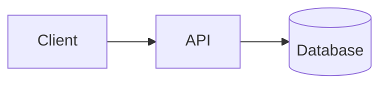

# diagram-render: render

Markdown ファイル内の ` ```mermaid ` コードブロックを [beautiful-mermaid](https://github.com/lukilabs/beautiful-mermaid) で SVG に変換し、Mermaid 以外の Markdown は通常通り HTML 化して、CSS 埋め込みの **自己完結 HTML ファイル** を出力する。

## 何を入力するか

入力は通常の Markdown ファイル。Mermaid 図は以下のように ` ```mermaid ` フェンスで記述する。

````markdown
# システム構成



説明テキスト...
````

## スクリプト

`./scripts/render.ts` (Bun 実行可能)

### 使い方

```bash
# 最小: 入力 Markdown を指定。出力は同階層の .html
./scripts/render.ts ./architecture.md

# 出力先・タイトル・テーマ指定
./scripts/render.ts ./architecture.md \
  -o ./out/architecture.html \
  -t "システム構成図" \
  --theme dark
```

### オプション

- `<input>` (位置) — 入力 Markdown パス（必須）
- `-o`, `--output` — 出力 HTML パス（省略時は `<input>.html`）
- `-t`, `--title` — HTML `<title>`（省略時は入力ファイル名）
- `--theme` — `light` または `dark`（default: `light`）
- `--transparent` — Mermaid SVG の背景を透過にする
- `--strict` — Mermaid ブロックに 1 つでもエラーがあれば exit 1（CI 用途）
- `--validate-only` — 構文検査のみ実行し HTML は書き出さない。エラーがあれば exit 1

### Mermaid バリデーション

スクリプトには Mermaid 構文検査が組み込まれている。

- 構文検査: 各ブロックを `beautiful-mermaid` でレンダリングし、失敗したブロックは HTML 内にエラー表示として埋め込み、stderr にも `[file:line] block #N: <error message>` を出力する
- 孤立ノード検出: `graph` / `flowchart` / `stateDiagram` のブロックで、どのエッジにも繋がっていないノード (例: `C[Orphan Node]` だけ書いて `C` を `-->` に登場させない) を検出してエラーにする
- CI 連携: `--strict` でエラー時に exit 1。GitHub Actions などのチェックに利用できる
- 検査のみ: `--validate-only` を付けると HTML を書き出さず構文検査のみ実行する

```bash
# 検査のみ (CI で使用)
./scripts/render.ts ./architecture.md --validate-only

# レンダリング + 厳格モード
./scripts/render.ts ./architecture.md --strict
```

### サポートされる Mermaid 図種

beautiful-mermaid は以下の図種をサポートする (他の図種は `Invalid mermaid header` エラーになる):

- `graph TD/LR/...`, `flowchart TD/LR/...`
- `sequenceDiagram`
- `classDiagram`
- `erDiagram`
- `stateDiagram` / `stateDiagram-v2`
- `xychart-beta`

## ワークフロー

1. ユーザーが書きたい図の内容を確認
2. Markdown ファイルを作成・編集（Mermaid ブロックを含む）
3. 上記スクリプトを実行して HTML を生成
4. 出力 HTML のパスをユーザーに伝える

## 注意

- 出力 HTML は CSS 埋め込みで完結し、ネットワーク不要で閲覧できる
- Mermaid 構文エラーがあるブロックはエラー表示に置き換わるが、他ブロックの描画は継続する
- beautiful-mermaid は同期 API。DOM 不要なのでヘッドレス環境でも動く
- 図の作成手順や図の種類別ガイドは `diagram-render:draw-diagram` スキルを参照
