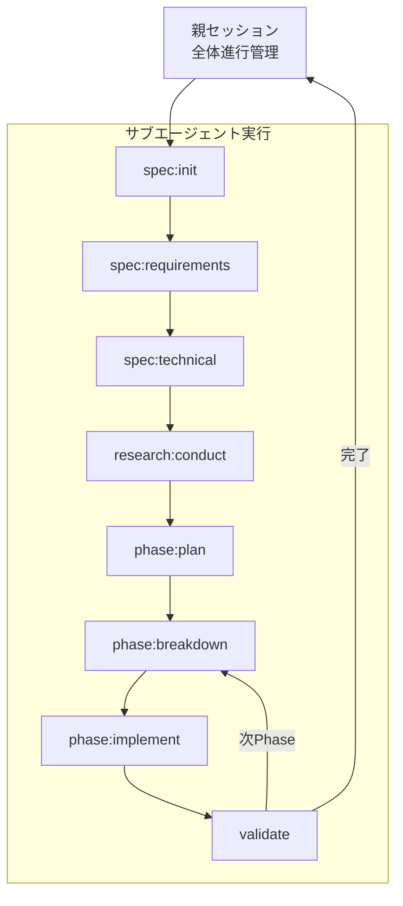

# SDD Autopilot

タスクを自動で進行するモード。親セッションとして動作し、各コマンドはサブエージェントで実行される。

## 概要

autopilot スキルを読み込むと、以下の自動進行モードが有効になる。

**引数:**

- `spec`: 対象の仕様書名（省略時は対話的に選択/新規作成）
- `phaseNumber`: 開始Phase番号（省略時は最初から or 中断箇所から再開）

## 動作フロー



## 親セッションの役割

1. **進行管理**: 全体の状態を把握し、次のコマンドを決定
2. **判断・回答**: サブエージェントで AskUserQuestion が発生した場合、親セッションがユーザー代わりに判断
3. **エラーハンドリング**: サブエージェントが失敗した場合のリカバリ

## サブエージェント実行パターン

各コマンドは Task ツールで実行:

```typescript
// 例: spec:init の実行
Task({
  subagent_type: "general-purpose",
  prompt: "/sdd:spec init ユーザー認証機能",
  description: "spec:init 実行",
});
```

## 自動判断のルール

親セッションがサブエージェントの代わりに判断する際のルール:

| 状況         | 判断基準                                                       |
| ------------ | -------------------------------------------------------------- |
| 複数案の選択 | ステアリングドキュメントに最も適合する案を選択                 |
| 不明点の解消 | 一般的なベストプラクティスに従う、または「**不明**」として保留 |
| エラー発生   | ログを記録し、次のステップへ進む or 中断                       |

## 用途

- **定型的なタスク**: 仕様が明確で判断が少ないタスクを一気に進める
- **プロトタイピング**: 素早く骨格を作成
- **夜間実行**: 人がいない間にベース実装を進める

## 注意事項

- 重要な判断が必要な場合は自動進行を中断してユーザーに確認
- `.claude/skills/steering/` が存在しない場合は先に steering スキルを実行
